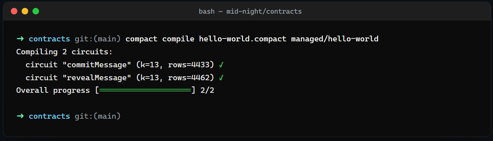
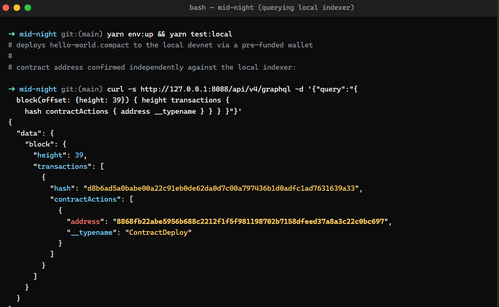

# mid-night — Commit/Reveal Hello World

## The idea.

Most "hello world" demos on public blockchains store a message directly on-chain,
which means the message is visible to anyone the instant it's submitted. This
project starts from a small but real privacy question: *can a user prove they
committed to a specific message at a specific point in time, without revealing
that message until they choose to?* That's the shape of a huge number of
real-world flows — sealed-bid auctions, voting, timestamped disclosures,
whistleblowing with proof-of-priority — and Midnight's zero-knowledge circuits
are a natural fit for it. This repo implements the smallest possible version
of that pattern: a two-step **commit/reveal** contract built on top of the
Midnight `hello-world` tutorial, plus a small API layer and a React UI so the
whole flow can be driven from a browser against a local devnet.

## What's in the repo

This is a Yarn workspace with three packages on top of the Compact contract:

```
contracts/    the Compact smart contract (commit/reveal) + compiled output
api/          TypeScript package wrapping contract providers for the UI
ui/           React (Vite) frontend for wallet connection + contract calls
src/          local devnet test/deploy scripts (vitest)
```

## Public state vs. private witness

The contract (`contracts/hello-world.compact`) is deliberately built around
Midnight's core privacy boundary: **ledger state is public, witnesses are
private and never leave the caller's machine.**

```compact
export ledger phase: Phase;              // public: Empty | Committed | Revealed
export ledger commitment: Bytes<32>;     // public: a hash, not the message
export ledger revealedMessage: Bytes<32>;// public: only set after reveal
export ledger round: Counter;            // public: how many commits have happened

witness secretMessage(): Bytes<32>;      // private: lives only on the caller's machine
witness secretSalt(): Bytes<32>;         // private: lives only on the caller's machine
```

- **`commitMessage()`** pulls the message and a random salt from the caller's
  private witnesses and writes only `persistentCommit(message, salt)` — a
  32-byte hash — to the public `commitment` ledger field. Anyone watching the
  chain sees that *a* commitment was made and the round counter advance, but
  the hash reveals nothing about the message's content or even its length.
- **`revealMessage()`** re-derives the same commitment from the *same*
  witnesses and asserts it equals the on-chain `commitment` before disclosing
  the message  via `disclose()`. Compact's compiler enforces this at the
  language level: a witness-derived value can't be assigned to a `ledger`
  field or returned from a circuit without an explicit `disclose()` call, so
  it's structurally impossible to leak the message earlier by accident.
- Because the witnesses never touch the chain until `revealMessage()` is
  called, a mismatched or fabricated message simply fails the on-chain
  assertion — the contract enforces the binding cryptographically, not just
  by convention in the client code.

See the comments at the top of `contracts/hello-world.compact` for the full
reasoning.

## Setup 
 
### Prerequisites 

- Node.js >= 22 
- [Yarn](https://yarnpkg.com/) (classic, 1.22.x)
- [Docker](https://www.docker.com/products/docker-desktop/) (for the local devnet: node + indexer + proof server)
- The [Compact CLI](https://docs.midnight.network/relnotes/compact-tools) (`compact`), used to compile the contract

### Install

```bash
git clone https://github.com/awr1n-ai/mid-night.git
cd mid-night
yarn install
```

### Compile the contract

```bash
yarn compile
# compact compile contracts/hello-world.compact contracts/managed/hello-world
```

This generates `contracts/managed/hello-world/` containing the ZK circuits,
proving/verifying keys, and the TypeScript API for the contract:



### Run the local devnet and deploy

Start Docker, then bring up the local node/indexer/proof-server stack and run
the deploy + commit/reveal test against it:

```bash
yarn env:up        # docker compose up -d --wait
yarn test:local    # deploys the contract and runs the commit/reveal flow
yarn env:down       # docker compose down
```

`test:local` deploys a fresh copy of the contract to the local devnet using
one of the pre-funded local wallets. The screenshot below confirms a deploy
by querying the local indexer directly for the block that contains the
`ContractDeploy` action and its address (useful in general, and specifically
because the `wallet-sdk-capabilities` submission watcher in this SDK version
is flaky against a fast-slot local devnet — the transaction itself lands on
first submission even on the runs where the client-side confirmation errors
out):



### Run the UI against the local devnet

```bash
yarn ui:dev
```

This builds the `api` package and starts the Vite dev server for `ui`, which
connects to a Midnight-compatible wallet extension and the contract deployed
above.

### Run against Preview / Preprod

1. Fund a wallet on the target network via the network's faucet page —
   [Preview](https://midnight-tmnight-preview.nethermind.dev/) or
   [Preprod](https://midnight-tmnight-preprod.nethermind.dev/).
2. Create `.env.<network>` based on `.env.<network>.example`.
3. `yarn proof:up`
4. `yarn test:<network>`

## Contract flow

```
constructor()        → phase = Empty
commitMessage()       → phase = Empty  → Committed   (writes commitment hash only)
revealMessage()       → phase = Committed → Revealed (discloses the message, only if it matches)
```

Calling `commitMessage()` again while `phase == Committed` fails; calling
`revealMessage()` before a commitment exists, or with a message that doesn't
match the stored commitment, also fails — both are enforced on-chain by
`assert`.
